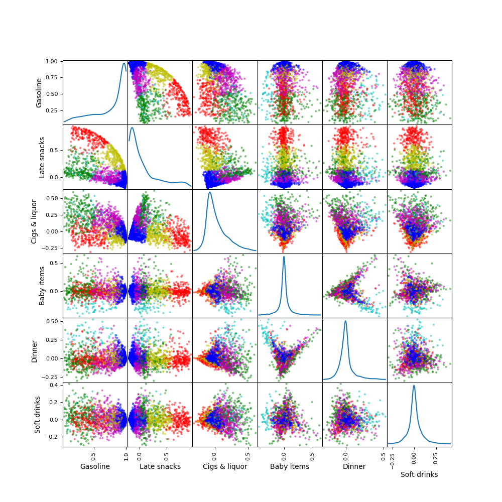
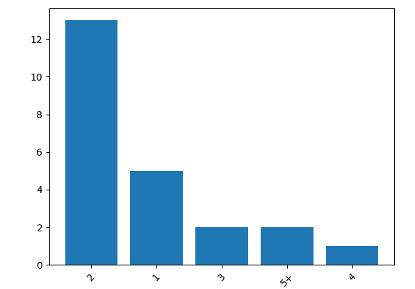
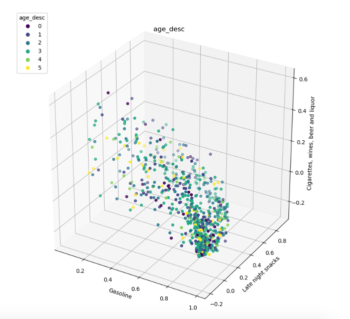

## Introduction

The goal of this section is to group households based on what they consume the most. In order to get better insight into the households in our dataset, we decided to group them using k-means clustering. We computed the number of times each household has ever bought a specific item. Since the number of purchasable items at the stores is about 2400, it is very difficult to cluster the households based on their bought items. We need to do a dimensionality reduction on the bought items, and turn them into groups. To do so, we will create a **bag of words** analogue, which we call **bag of commodities**. Then we will do SVD, where keep 300 features. We get a **household vs. group** , and a **group vs. item** matrix describing all the groups in terms of items. We applied TF-IDF normalisation in order to reduce the importance of the articles bought frequently by almost every household.  

We can then take the household vs. group matrix and find k-means clusters.  

Finally we can find if there is any relation between these clusters and the demographic data.  
The results show that there are groups of items often bought together, such as baby items or wine and cigarettes. However, the groups that overshadowed all others was the gasoline group, as it is the most bought item overall by far. 

## Kmeans

We chose the optimal number of cluster by calculating the silhouette coefficient for each possible cluster number and taking the highest one.

```html
   <p align="right">The groups obtained by kmeans clustering appear to be well separated if we plot them with the 3 groups that explain most of the variance.</p>     
```

 

The groups obtained by kmeans clustering appear to be well separated if we plot them with the 3 groups that explain most of the variance. 


In order to get a more detailed view, we use the scatter plot matrix. We indeed see that the three first categories explain most of the variance because the groups are clearly separated along these axis. The gasoline group, in red is clearly separated from all others. This is a particularity of the shopping habbits of these households. Indeed, as it was shown before, gasoline is the highest bought item by sales value by far.

Another interesting point is that the soft drinks group does not seem to have specific consumption patterns in the other groups, rather, it seems to include households from all the other groups indiscriminantely. This makes sense, as soft drinks are consumed by people from a very broad demographic and there are also many variants of soft drinks marketed towards different demographics. 



We see that even though some clusters overlap we see that clusters are representative:

* Red: Gasoline group: gasoline consumption clearly higher than all other groups, But there is significant separation with the late night snacks group, which indicates that people who come to buy gasoline often also get food. Some overlapp with cigs & liquors and baby items. 

* Blue: Late night snacks: Also buy gasoline but barely anything else, also some overlap with soft drinks and baby items

* Green: Cigs & liquor: medium snacks and high gasoline

* Yellow: Baby items: also consume snacks, medium consumption of cigarettes and liquor!

* Magenta: Dinner: Clearly stands out for high gasoline, cigarettes and liquor consumption

* Cyan: Soft drinks: Very diffuse/ sparse group, Indicates that the households in this group have a very varied consumption of items in other groups. Suggests that soft drinks appeal to a very large demographic group


From the distributions we see that the gasoline group is strongly skewed to the right, approximately follows a heavy tailed distribution and all the values are positive, which means that all the households consume from this group. Liquor and cigarettes and Late night snacks have similar distributions skewed to the left, meaning that most people do not buy from these groups. 

Another reason why there are not more specific individual patterns emerging from this analysis is that all our transaction data is at the household level and the composition of a household can be very heterogeneous, so we would almost certainly find other more granular consumption patterns with individual transaction data.

Also, the shopping card might only be used for the weekly grocery shopping but the individual members of a household might go to the store for smaller transactions without using the card, as it may remain with a single person.

## Demographics


A more detailed analysis of the demographic composition of our cluster seems to confirm this hypothesis. Here, the demographic distributions are shown for each group to enable to get a better sense of their respective demographic compositions.



 Indeed, even tough the products purchased by the different groups are vastly different, think of baby items versus cigarettes and wine, he most representative individual of each group has exactly the same age, income and lives in a household of the same size. It is however interesting to note that these parameters differ significantly from the US median demographic parameters.

<table border="1" class="dataframe">
  <thead>
    <tr style="text-align: right;">
      <th></th>
      <th>age</th>
      <th>income</th>
      <th>household size</th>
    </tr>
  </thead>
  <tbody>
    <tr>
      <td>Gasoline</td>
      <td>45-54</td>
      <td>50-74K</td>
      <td>2</td>
    </tr>
    <tr>
      <td>Late snacks</td>
      <td>45-54</td>
      <td>35-49K</td>
      <td>2</td>
    </tr>
    <tr>
      <td>Cigs &amp; liquor</td>
      <td>45-54</td>
      <td>50-74K</td>
      <td>2</td>
    </tr>
    <tr>
      <td>US population</td>
      <td>38.2</td>
      <td>32K</td>
      <td>2.6</td>
    </tr>
  </tbody>
</table>

Also, observing the distribution of the demographic parameters visually in the clusters do not yield explicit groups. The households appear to be randomly distributed.



To summarise, our clustering approach to discover household groups who have similar consumption patterns yielded many different groups that focus on different item categories. However, the explained variance of this approach was not very high and the groups were mainly overshadowed by the enormous gasoline consumption. One interesting aspect uncovered is that unhealthy eating habbits such as soft drinks and alcohol consumption are widespread among these household.  

In the next part, we will take a closer look at food consumption among different population subgroups.